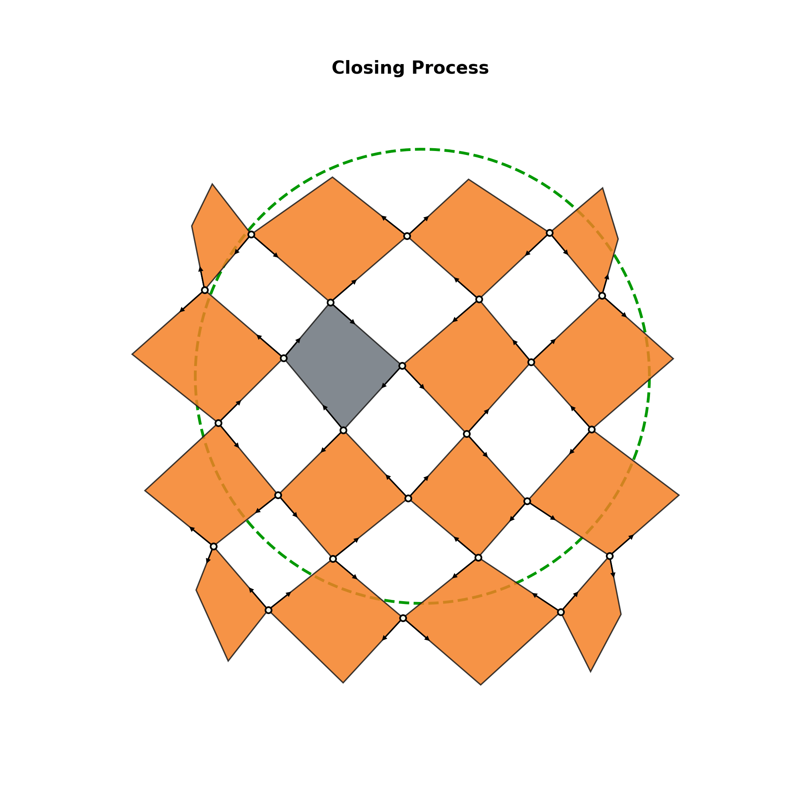
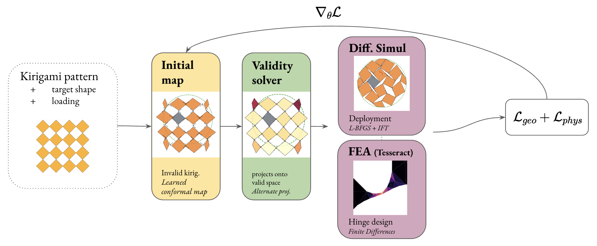
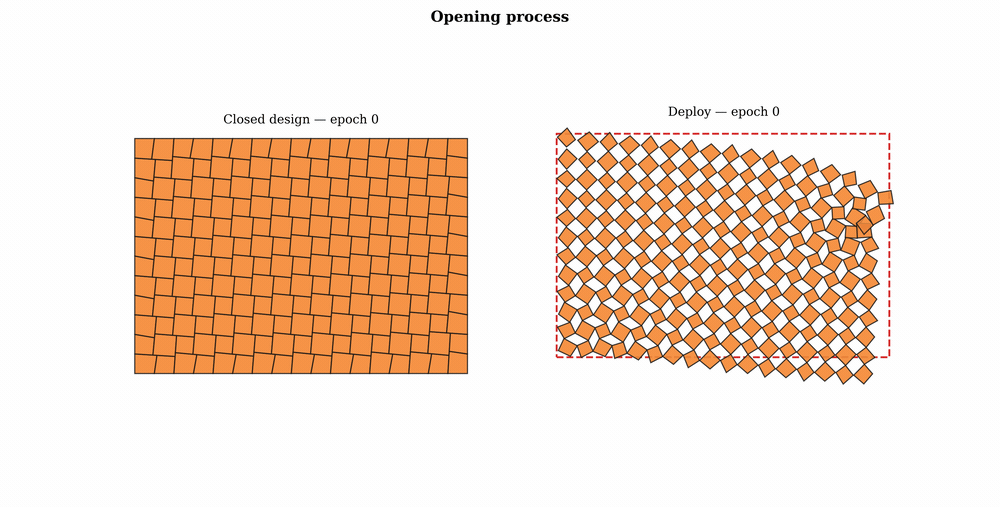
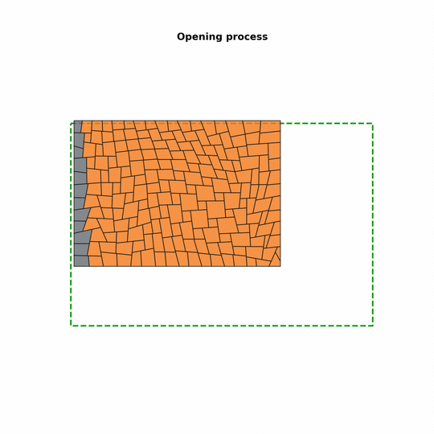

# Neural Form-Finding

End-to-end differentiable pipeline for the inverse design of deployable Kirigami structures. A geometric mapping stage, a kirigami validity solver, and a physical simulator — all in JAX, fully differentiable, trained by gradient descent on a shape-matching objective.

Developed at the **Princeton Form Finding Lab**.

<p align="center">
  
</p>
<p align="center"><em>An MPNN-designed Kirigami closing onto its target shape — the output of the differentiable pipeline.</em></p>

---

## Pipeline overview

The forward pipeline is a chain of three independent, swappable stages. Gradients flow end-to-end through all three via `jax.value_and_grad`.

<p align="center">
  
</p>

```
Flat tessellation  (CentroidalState)
        │
        ▼  Stage 0 — Initial Mapping
        │   Any function CentroidalState → CentroidalState.
        │   Current options: GNN (EGNN, MPNN), analytical polynomial maps,
        │   asymmetric root maps, direct vertex optimisation.
        │
        ▼  Stage 1 — Kirigami Validity Solver
        │   Enforces the geometric laws of valid Kirigami (hinge connectivity,
        │   face non-intersection, symmetry). Applied fully or partially
        │   depending on the configuration.
        │   Methods: L-BFGS (jaxopt) or alternating projections.
        │
        ▼  Stage 2 — Physical Simulator
        │   Minimises total potential energy (elastic strain + contact − work)
        │   under the applied loads. Incremental load stepping via jax.lax.scan.
        │   Solver: L-BFGS (jaxopt), with optional Updated Lagrangian.
        │
        ▼  Loss
            Chamfer distance (boundary vertices vs. target shape)
          + physical energy penalties (stretch, shear, bending, contact)
          + optional: hinge gap, openness, deformation, regularisation
```

Each stage is defined by a single interface. Swapping an implementation only requires changing the routing inside `forward_pipeline` — nothing else.

---

## Closed-state inverse design

The same pipeline runs *in reverse*. Instead of closing an open Kirigami onto a target, it starts from a **flat closed sheet** (the Dang et al. 2021 RDPQK construction) and **deploys it with the physics solver** to match a target shape. Stage 1 is bypassed: the design parameterisation — per-cut aspect ratios plus ordered boundary sliders — is a Tutte embedding, so every design is non-self-intersecting by construction. The design variables are optimised end-to-end *through* the Stage-2 deployment.

The example below is a half-tile A4 beam (17 × 12 = 204 panels) loaded as a cantilever: the left edge is clamped, the whole right edge is pulled, and a downward load is applied near the top-right corner. Over training, the flat cut pattern reorganises so the physics-deployed sheet fills its target rectangle.

<p align="center">
  
</p>
<p align="center"><em>Training evolution — the flat closed design (left) reorganises so the physics-deployed sheet (right) fills its target rectangle.</em></p>

<p align="center">
  
</p>
<p align="center"><em>The trained design deploying from the flat sheet to its loaded equilibrium.</em></p>

```bash
# Closed-state runs use run_closed.py (forces float64), not train.py
JAX_PLATFORMS=cpu python nff/scripts/run_closed.py \
    --config-name rect_a4_beam_half_f200_below --every 8
```

Every visual lands in a single `data/outputs/runs/run_<timestamp>_<config>/` folder. Configs live in `data/configs/closed/`.

---

## Installation

```bash
conda env create -f environment.yml
conda activate kgnn_mac

# Install the nff package in editable mode
pip install -e .
```

JAX is forced to CPU and float64 globally inside `train.py`. Do not set `JAX_PLATFORM_NAME` yourself.

---

## Running experiments

### Architecture + problem suite (recommended for GNNs)

```bash
# Canonical MPNN baseline (the animation above)
python nff/scripts/train.py --arch architectures/mpnn_best_2x2 \
                            --suite problems/suite_compressive_t187

# Selected problems
python nff/scripts/train.py --arch architectures/egnn_base --suite problems/suite_compressive \
                            --problem-ids p001,p005,p010
```

Outputs are written to `data/outputs/runs/run_<timestamp>_<arch>/`.

### Single config (legacy analytical maps)

```bash
python train.py --config-dir asymmetric_roots --config-name 2_free
```

Config files live under `data/configs/<config-dir>/<config-name>.yaml`.

### Programmatic

```python
import jax
jax.config.update("jax_enable_x64", True)

from nff.config.experiment import load_and_parse_config
from nff.stages.pipeline import forward_pipeline
from nff.training.trainer import train_pipeline

config = load_and_parse_config("data/configs/architectures/mpnn_base.yaml")
# ... build initial_state, call train_pipeline(map_params, initial_state, ...)
```

---

## Package structure

```
nff/
├── topology/               Tessellation geometry — pure NumPy, no JAX
│   ├── core.py             UnitPattern, Tessellation, IndexedFace, Hinge
│   └── builder.py          build_tessellation(pattern, nx, ny) → Tessellation
│
├── config/                 Experiment configuration — no JAX compute
│   ├── experiment.py       ExperimentConfig + YAML parsers
│   ├── conditions.py       Apply BCs and loads to a Tessellation
│   └── targets.py          Target shape point clouds (circle, heart, …)
│
├── models/                 Stage 0 — GNN architectures
│   ├── egnn.py             E(2)-equivariant GNN: init_egnn, apply_egnn
│   ├── mpnn.py             Non-equivariant MPNN: init_mpnn, apply_mpnn
│   └── graph_builder.py    Tessellation → jraph.GraphsTuple
│
├── stages/                 The three pipeline stages
│   ├── state.py            CentroidalState — the central data structure
│   ├── mapping.py          Stage 0: analytical and GNN mapping engines
│   ├── validity.py         Stage 1 (L-BFGS): solve_geometric_validity()
│   ├── projection.py       Stage 1 (alternating): solve_alternating_projections()
│   ├── pipeline.py         forward_pipeline() — orchestrates all three stages
│   └── physics/            Stage 2 internals (energy, kinematics, loading, statics)
│
├── training/               Optimisation loop
│   ├── loss.py             evaluate_physical_loss(), compute_end_to_end_loss()
│   └── trainer.py          TrainState, create_train_step(), train_pipeline()
│
├── utils/
│   ├── visualization.py    Tessellation + animate_tessellation() (closing GIFs)
│   └── pipeline_viz.py     Per-stage visualisation, loss curves
│
└── sofa/                   JAX-side bridge to the SOFA oracle (kgnn_mac, no Sofa import)
    ├── tesseract_client.py Typed Tesseract HTTP client (apply / jacobian / decode)
    ├── mesh_builder_gmsh.py CentroidalState → gmsh tet mesh (source of truth)
    ├── config_to_physical.py YAML → physical CS namespace
    ├── fatigue.py          Coffin–Manson cycles-to-failure
    └── hinge_viz.py        Shared Princeton palette + hinge plotting helpers
```

---

## Central data structure: `CentroidalState`

`CentroidalState` is an immutable `NamedTuple` that flows through all three stages. Fields split into two groups with different JAX semantics:

| Group | Storage | Fields |
|---|---|---|
| **Optimizable** | `jnp.array` float64 | `face_centroids (n,2)`, `centroid_node_vectors (n, max_nodes, 2)` + mechanical properties |
| **Fixed topology** | `np.array` int32 | `hinge_face_pairs`, `bond_connectivity`, `constrained_face_DOF_pairs`, … |

Topology arrays are **never** JAX Tracers. They are used as static indices inside JIT-compiled functions. Converting them to `jnp.array` breaks the solver.

Built via: `CentroidalState.from_tessellation(tessellation)`.

---

## Config YAML structure

**Architecture files** (`data/configs/architectures/`) define the model, mapping type, and training hyper-parameters.
**Problem suite files** (`data/configs/problems/`) define BCs, loads, material, and physics per problem.
Both are merged at runtime by `merge_arch_problem()`.

```yaml
tessellation:         # pattern name, grid size (width × height), total_area
mapping:              # map_type, map_params, domain_restriction, …
target:               # type (circle | heart), center, radius
physics:              # incremental, num_load_steps, stiffnesses, contact
material:             # k_stretch, k_shear, k_rot, density
boundary_conditions:  # clamped_faces (list of face ids or "boundary")
loads:                # [{face, dof, value}] or typed [{type, source_face, …}]
training:             # num_epochs, learning_rate, lr_schedule, grad_clip
loss_weights:         # chamfer, coverage, stretching, shearing, hinge_gap, …
visualization:        # stage0/1/2, animation, save_outputs, show_hinges, …
```

---

## SOFA physics oracle (branch `Tesseract_SOFA`)

A high-fidelity SOFA finite-element solver complements the JAX pipeline where the reduced
spring model cannot reach: the true 3D mechanics of a hinge. It is wrapped as a
[Tesseract](https://github.com/pasteurlabs/tesseract-core) — a versioned Docker image that
exposes `/apply` (run SOFA) and `/jacobian` (finite-difference gradients) over HTTP — so the
non-differentiable solver becomes a differentiable function call.

Today it powers a standalone hinge-shape optimizer: nine Bézier parameters → a conforming
gmsh tetrahedral mesh → SOFA SvK simulation under a prescribed fold → fatigue-life objective,
optimized by gradient descent. We use it to design a TPU hinge that survives folding to 90°,
and to *measure* the hinge's real stiffness — feeding those values back into the JAX Stage-2
springs. The full narrative is in `docs/Teaching a fast designer to respect real physics.md`.

```bash
# Build + serve the oracle (Docker, linux/amd64)
tesseract build sofa/
docker run -d -p 8000:8000 -e TESSERACT_RUNTIME_SERVE_HOST=0.0.0.0 nff-sofa-oracle:latest serve

# Optimize a hinge against the oracle
python nff/sofa/hinge_optimizer.py --config data/configs/sofa/hinge_opt_2face.yaml
```

The SOFA code is split across two environments by design — `sofa/` runs inside the Docker/SOFA
runtime, `nff/sofa/` is the JAX-side client. See `sofa/ARCHITECTURE.md` for the boundary.

---

## Naming conventions

- **`_fn` suffix** — every callable produced by a factory or passed as a callback: `potential_energy_fn`, `solve_statics_fn`, `mapping_fn`.
- **`build_*` prefix** — factory functions.
- **Descriptive array names** — `initial_displacements`, not `u0`; `face_centroids`, not `x`.
- **JAX arrays** — `jnp.array` for anything that may receive gradients; **index arrays** — `np.array` (int32) for topology, never traced by JAX.
