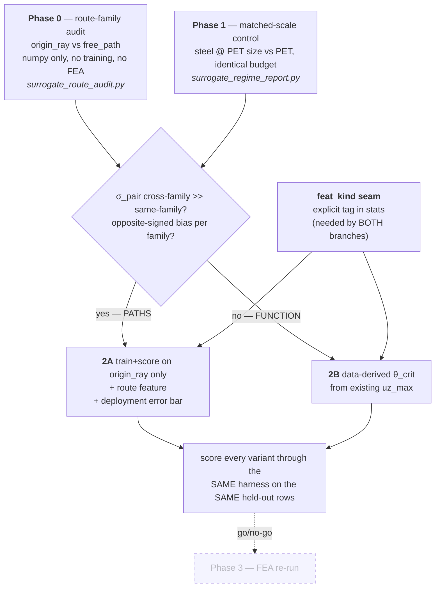

# PET surrogate: the route-family audit — test the PATH hypothesis before rebuilding the FUNCTION

> Working plan + findings, 2026-07-31. Phase 0 is implemented and pushed; the verdict needs a
> local run against `data/fea/` (this was written in a sandbox with no dataset and no `ccx`).
> Companion to `hinge_surrogate_validation_plan.md` (the oracle gate) and
> `hinge_surrogate_condensation.md` (the WHAT/WHY of the condensation).

## Context

The hinge surrogate reaches **1.85% energy relRMSE on the steel campaign** and **~21% on PET**, at
matched job-disjoint nearest-neighbour spacing (0.246 vs 0.239). The draft plan concluded the
difference is the *function* — deep post-buckling shell mechanics — and proposed a `*BUCKLE`
eigen-campaign to supply `θ/θ_crit`.

Reading the campaign code turns up a **third explanation the draft does not consider, which fits the
evidence better and is decidable with pure numpy on data already on disk**: the two campaigns drove
**structurally different displacement paths**, and `W` is a path functional, not a state function.

### The two campaigns sample different route families

| | steel — `sample_jobs` (`nff/rve/dataset.py:52`) | PET — `sample_campaign_jobs` (`nff/rve/path_prior.py:144`) |
|---|---|---|
| spine (25% of jobs) | `DeploymentRay(θ, 0, 0)`, `free_dofs=()` — **a=s=0 prescribed** | `DeploymentRay(θ, 0, 0, free_dofs=("a","s"))` — **a, s chosen by the solver** |
| fan | straight proportional rays, `eta_a ∈ [0, 1]` (tension only) | straight rays over the measured envelope, `a` **two-sided** (~40% compressive) |
| steps | flat `n_steps` | `steps_for()` — variable per job, ~constant deg/step |

`nff/rve/hinge_function.py:132-135`: with `free_dofs` "the arc is driven through a `*RIGID BODY`
reference node on the pivot and the solver picks the translation that minimises energy at each
imposed rotation." `nff/rve/ccx_solver.py:517-524` then **reads `a` and `s` back off that node** —
in the PET npz, a quarter of the jobs have `a`/`s` columns that are solver *outputs*, tracing a
curved, non-proportional, largely compressive trajectory through `(a, s, θ)`.
`nff/rve/path_prior.py:154` records one: "at a 28 deg fold the solver picks `a = -4.10 mm` and pays
**23% less** than a forced small opening."

The steel campaign has no such family. Every steel job is a fully prescribed, monotonic,
proportional ray from the origin.

### Why steel was immune — and why "fan vs spine" is not quite the distinction

Steel also had a spine and a fan, so the split that matters is not spine-vs-fan. It is
**origin-ray vs non-origin-ray**, and steel's spine and fan are *both* origin rays:

- steel spine: `u(λ) = λ·(0, 0, θ₁)` — a ray in direction `(0,0,1)`
- steel fan: `u(λ) = λ·(a₁, s₁, θ₁)` — a ray in direction `(a₁, s₁, θ₁)`

Rays from a common origin **foliate** the state space: two of them meet only at `0`. So on a
prescribed-ray campaign, the path that reached a state is *recoverable from the state itself* —
direction is `u/‖u‖`, and every earlier state on that path is just `λ·u`. **The history is a function
of the state.** `W` is therefore single-valued in `(a, s, θ)` on that dataset, and a state-function
surrogate is exactly the right object to fit. Path-dependence was never absent from steel; the
sampling design simply made it invisible.

PET's free-DOF spine is a **curve that cuts across that foliation**. It is not `λ·u` for any fixed
direction — the solver re-picks `(a, s)` at every imposed rotation, and picks compressively
(`a = -4.10 mm` at 28°). So it crosses origin rays belonging to *other* jobs, and at each crossing
`W` takes two different values: the ray's accumulated work, and the curve's. That is the
multi-valuedness, and it enters the dataset the moment `free_dofs=("a","s")` was added — the one
sampling change between the two campaigns that breaks the foliation.

Two-sided `a` (PET's ~40% compressive fan) is a real difference too but a **secondary** one: a
two-sided fan is still a family of origin rays, still non-crossing, still single-valued. It widens
the domain; it does not make the target ambiguous.

This yields a sharp, falsifiable prediction that Phase 2A tests directly: **a net trained and scored
on PET's origin-ray jobs alone should approach steel's accuracy**, at PET's full fold depth — which
would simultaneously refute "deep post-buckling is an intrinsically harder function", since those
rows are just as deeply buckled.

### Why this matters more than the buckling regime

`nff/rve/hinge_function.py:150-153` states the problem outright: "The oracle is elastoplastic, so
`W` is a path-dependent work rather than a potential: two routes to the same endpoint do not carry
the same energy or the same accumulated damage. A surrogate fitted as a state function
`W(a, s, θ)` is therefore only legitimate if it is trained along paths resembling the ones the
deployed sheet actually rides."

`nff/scripts/calibration/audit_path_dependence.py:11` puts a number on it: an earlier paired sample
gave **+65% on `W`** and **3.2× on damage** between a measured polyline and a straight ray to the
*same endpoint*. That is an order of magnitude above the 5% target.

If the training set mixes route families, `W` is **multi-valued in the network's own input** and no
architecture and no amount of data can fix it. Five observations line up with this and not with
"post-buckling is a harder function":

1. **Feeding the true `uz_max` moved a k-NN baseline only 25.1% → 22.4%.** `uz_max` is a *state*
   variable. If the residual is *history*, no state variable can recover it — and `θ/θ_crit` is
   also a state variable, so Phase 2 as drafted is predicted to fail for the same reason.
2. **1-NN matches the net; eight architecture levers inert.** Textbook multi-valued target: the best
   any state-function estimator can do is the conditional mean, and 1-NN is already there.
3. **Error is flat in θ but jumps ~4× at uz/t ≈ 15.** Route divergence in accumulated plastic work
   grows with *dissipation depth*, not with rotation. That is the observed signature.
4. **A surviving *under-predicted* branch** (the draft's own verification item 5). Regressing to the
   mean of two route families over-predicts one and under-predicts the other. A merely harder
   function gives symmetric scatter, not a systematic signed branch.
5. **The reproducibility evidence does not rule this out.** The 0.1–0.4% oracle-reproducibility check
   re-ran the *same job* under immaterial perturbations. That shows `W` is deterministic in
   (geometry, **path**). It says nothing about `W` being single-valued in (geometry, **state**).
   The draft's "so `W` is single-valued" conflates the two.

This also rehabilitates the σ_pair statistic the draft discarded. Pooled over all pairs, σ_pair mixes
route families, so its floor looked like it should bind and then didn't. **Conditioned on route
family** it becomes the decisive measurement — and it costs one numpy script.

**Goal:** decide between the path hypothesis and the function hypothesis with two cheap, falsifiable
experiments on data already on disk, then implement the fix the answer selects. Reach ≤5% without a
large campaign.

### User decisions taken

- **θ_crit, if needed, is data-derived** from the existing `uz_max` column — no `*BUCKLE` campaign.
  `uz_max` is already a first-class dataset column (`nff/rve/dataset.py:150`), whereas `*BUCKLE`
  exists nowhere: `_write_deck` emits `*STATIC` only (`ccx_solver.py:281-291`), `_parse_dat`
  recognizes no eigenvalue header, and a mode shape lands in the `.frd` as an extra `DISP` block
  that would break `parse_job`'s time alignment (`ccx_solver.py:511`).
- **Phase 3 (re-running the job list with more `*STEP`s) is deferred**, not implemented. It is also
  in tension with a recorded measurement: `run_pet_campaign.sh:23-25` — finer stepping (2.5° → 4.0°)
  did *not* cut deep-fold divergence over 46 deep folds (22% vs 26%, indistinguishable).

### Environment constraint

This container has **no dataset, no `ccx`, no `jax`, no `pytest`** (`data/*` is gitignored;
`docs/hinge_dataset_v2_runbook.md:22` notes `ccx` is not on the dev machine either). Everything below
is written to be **executed locally** in the `kgnn_mac` / `ccx` conda envs. The deliverable from this
session is committed code plus the exact commands; the numbers come from the local run.

---

## STATUS — Phase 0 is BUILT, TESTED and PUSHED (commit `74944b5`)

On branch `claude/refine-local-plan-dhoqnt`:

| file | state |
|---|---|
| `nff/scripts/diagnostics/surrogate_route_audit.py` | **new, working** — classification, family-conditioned σ_pair, oracle-feature probe, per-family signed residual |
| `nff/utils/splits.py` | **new** — `split_by_job` moved here (it lived in a module importing jax+optax); the trainer re-exports it, `plot_surrogate_parity.py` unchanged |
| `tests/test_route_audit.py` | **new** — 8 tests, all passing; suite 217 → 225 |

**Not yet run on real data** — this container has no `data/` (gitignored) and no `ccx`. The verdict
comes from running it locally.

### Findings already established

1. **The naive σ_pair estimator returns a FALSE NEGATIVE.** Raw `|W_i − W_j|` between matched rows is
   dominated by the ordinary first-order change in `W` across the gap. On a synthetic fixture whose
   oracle is *known* to be path-dependent, raw gives **1.12×** — which would read as "hypothesis
   refuted". Subtracting the expected difference via the stored `dW/du` (trapezoidal, 2nd-order)
   gives **4.15×** on identical data. The Sobolev labels are what make the test work at all. Pinned
   by `test_cross_family_spread_survives_the_correction`.
2. **JAX-pipeline compatibility for the internal-variable route is CONFIRMED** — see §2C. Every
   structural prerequisite already exists in `nff/stages/physics/statics.py`.
3. **The oracle probe reproduces the predicted signature** on the fixture: `+damage` (history) cut
   free-path error 0.244 → 0.114, while `+uz_max` (state) did nothing (0.244 → 0.235).
4. Pre-existing suite failures (8 failed / 5 errors) are **byte-identical with and without** these
   changes — missing `jax_md` and jax version drift in the sandbox, not regressions.

### Run these locally to get the verdict

```bash
# steel FIRST -- the control. Must come back ~100% origin_ray.
conda run -n kgnn_mac python -m nff.scripts.diagnostics.surrogate_route_audit \
    --data data/fea/hinge_dataset

conda run -n kgnn_mac python -m nff.scripts.diagnostics.surrogate_route_audit \
    --data data/fea/hinge_dataset_pet_v2 \
    --surrogate data/surrogates/hinge_surrogate_pet_v2
```

Decision rules, in priority order:

| observation | reading | next |
|---|---|---|
| steel not ~100% `origin_ray` | the foliation argument is wrong | stop; re-derive |
| σ_pair(cross)/σ_pair(same) ≥ 2 | target is multi-valued | **2A**, then **2C** |
| per-family biases opposite-signed | confirms it independently | **2A** |
| `+damage` ≫ `+uz_max` in the probe | missing information is history, and `D` carries it | **2C** with `z = D` |
| ratio ≈ 1 and biases same-signed | path hypothesis refuted | **2B** |

### Still to build

Phase 1 (`surrogate_regime_report.py`, the shared scoring harness; `--damage-col none`;
`--subsample-jobs`; `--uz-over-t-max`), Phase 0.4 (the `check_force_sign` silent false-pass), and
whichever of 2A/2B/2C the verdict selects. §2.0's `feat_kind` seam is needed by 2B and 2C both.

---

## Shape of the change



Phase 0 and Phase 1 are independent and should run concurrently. The `feat_kind` seam is built once
regardless of which branch Phase 0 selects.

---

## Phase 0 — Route-family audit (decisive, ~1 h, no training, no FEA)

**New file: `nff/scripts/diagnostics/surrogate_route_audit.py`.** Pure numpy over
`<data>.npz` + `<data>.json`. Follows the house diagnostics conventions
(`argparse(description=__doc__)`, `--out` resolved to a directory in `main`, `os.makedirs(exist_ok=True)`,
`fig.savefig(..., dpi=150, bbox_inches="tight")`, final `print(f"wrote {out_dir}")` — see
`nff/scripts/diagnostics/extract_hinge_paths.py:53` and `diagnose_landscape.py:259`).

### 0.1 Classify each job's route family

The `.json` `jobs` block (`nff/rve/dataset.py:172-180`) carries `job_id`, `eta_a`, `eta_s`,
`theta1_deg`, `w_lig`, `alpha_deg`, `stop_reason`. Free-DOF spine jobs are constructed as
`DeploymentRay(θ, 0.0, 0.0, ..., free_dofs=("a","s"))`, so they record `eta_a == eta_s == 0` — while
their npz rows carry solver-chosen nonzero `a`, `s`. That gives an exact classifier:

The classification that matters is **origin-ray vs non-origin-ray** (see "Why steel was immune"),
not spine vs fan:

| family | test | present in |
|---|---|---|
| `free_path` | meta `eta_a == 0 and eta_s == 0` **and** row `max abs(a) > 1e-6` | PET only |
| `origin_ray` | everything else — meta `eta` nonzero, or `eta == 0` with rows `a = s = 0` | steel + PET |

Validate it independently with a per-job proportionality test that needs no `.json` at all — this is
the *definitional* test, so prefer it and use the `.json` only as a cross-check: regress `a` and `s`
on `θ` through the origin and take the residual fraction. An origin ray is exactly proportional; a
free-DOF path is not. Report the confusion matrix between the two classifiers — they must agree, and
a disagreement means the `.json` and `.npz` are out of sync.

**Run the audit on the steel dataset too, as the control.** Steel must classify as ~100%
`origin_ray`. If it does, the foliation argument holds and steel's 1.85% is explained by its sampling
design rather than by its physics regime — which is the whole claim.

Also split `ray` into in-envelope vs inflated (`inflate_frac=0.30` of the fan is sampled over a
1.5× envelope, `path_prior.py:145`) by testing the endpoint against `measure_envelope(prior_dir)`;
report it as a sub-family but do not branch on it.

### 0.2 The decisive statistic — σ_pair conditioned on family

Over pairs of rows drawn from **different jobs at near-identical geometry** (`|Δlog w_lig|`,
`|Δα|` below a tolerance) and near-identical kinematics (`|Δu|` normalized by the job-disjoint NN
spacing already measured, 0.239), report the paired spread in `W`:

- `σ_pair(same family)` — both rows `origin_ray`, or both `free_path`
- `σ_pair(cross family)` — one of each
- `σ_pair(steel)` — the control. Steel is all `origin_ray`, so this is a same-family number and must
  be small. It calibrates the scale of the other two.

**Decision rule.** If `σ_pair(cross) / σ_pair(same) ≳ 2`, the target is multi-valued in the network's
input and the path hypothesis is carried. If the two are comparable, the path hypothesis is refuted
and Phase 2 goes to branch 2B. Report both numbers regardless of which way they fall.

Stratify by `uz/t` band. The prediction under the path hypothesis is that the ratio **grows with fold
depth** — that is precisely the 4× jump at `uz/t ≈ 15` the draft attributes to the function.

### 0.3 Per-family error decomposition of the existing checkpoint

Load `data/surrogates/hinge_surrogate_pet_v2.pkl` and score the held-out rows **per family**,
reporting relRMSE *and* the **signed mean relative residual** (the bias). Reuse `split_by_job` and
`evaluate` from `nff/scripts/train_hinge_surrogate.py` — `plot_surrogate_parity.py:29-31` already
imports them that way, so no new loading code.

The path hypothesis predicts **opposite-signed bias** between `free_path` and `origin_ray` — the net
regresses to the mean of two route families, so it over-predicts one and under-predicts the other. A
"harder function" predicts near-zero bias in both with larger scatter. **This one number separates
the two hypotheses on its own**, and it is what the draft's "surviving under-predicted branch" is
already showing.

### 0.4 Fix a latent bug this exposes

`check_force_sign` (`train_hinge_surrogate.py:90-107`) probes only jobs with
`max abs(a) < 1e-9 and max abs(s) < 1e-9`. On the PET dataset **no such job exists** — the spine is
free-DOF and the fan draws `eta` from a continuous envelope. So `ratios` is empty, line 106 falls
back to `r = 1.0`, and the trainer prints `force-sign check: ... ~ +1.000 -> match` **without having
checked anything.** Make the empty case explicit: print `no pure-rotation probe jobs found — force
sign UNVERIFIED` and, so the check still runs, fall back to probing the lowest-`|η|` jobs with a
finite-difference along their own path. This is a real silent false-pass on every PET run to date.

**Deliverables:** `route_audit.json` (family counts for PET *and* steel, σ_pair table incl. the steel
control, per-family signed-bias table, all stratified by `uz/t` band), `sigma_pair_by_family.png`,
`residual_by_family.png`, and a printed summary.

---

## Phase 1 — Matched-scale control (~1 h of training, runs concurrently with Phase 0)

**New file: `nff/scripts/diagnostics/surrogate_regime_report.py`.** This is the **single scoring
harness** every later variant is measured through, so numbers stay comparable (draft verification
item 2). It takes `--surrogate` and `--data`, re-derives the split with the trainer's own
`split_by_job(val_frac, seed, test_frac)` — note `plot_surrogate_parity.py:101` uses the **2-way**
form, so its "held-out" is the *val* group, not the test group; this harness must use the 3-way form
to match the trainer — and emits the per-band relRMSE tables (by `uz_max/t` and by `θ`) that the
draft quotes. No such script exists today; those tables were produced ad hoc.

Two training runs, both on data already on disk:

**1.1 — Steel at PET's scale.** Subsample `hinge_dataset` to PET's row and job count, same
architecture, same update budget.
- ⚠ `load_dataset` hard-raises on that npz: it predates the `damage` column
  (`train_hinge_surrogate.py:49-55`). Do **not** weaken that guard. Add an opt-in
  `--damage-col none` to the trainer that substitutes a constant-1.0 damage target; combined with
  `--w-damage 0` the damage head is supervised on a constant with weight zero, i.e. inert, and
  `compute_norm_stats(D=...)` still yields a finite `D_scale = 1.0` so `sobolev_loss` keeps its
  fixed-scale branch (`hinge_surrogate.py:524-527` dereferences `stats["D_scale"]` unconditionally
  once `sigma_F` is present — passing `D=None` there is a `KeyError`, not a fallback).
- Run **both arms energy-only and matched**: `--lam 1.0 --w-damage 0.0`, identical `--hidden`,
  `--epochs`, `--batch`, `--seed`. The historical 21% number came from a `--lam 0.7` run and is
  **not** a valid comparison point — re-train the PET arm too rather than quoting it.

**1.2 — PET restricted to the mildly-buckled regime.** Train and score on `uz_max/t < 15` rows only.
Restrict by **whole job**, not by row: dropping the deep tail of a job mid-path leaves a path whose
plastic history is truncated, which is the very confound under test.

**Read the result together with Phase 0.** Steel staying at 2–5% at PET's size rules out data volume
— but it does *not* discriminate paths from function, because the steel campaign has no free-DOF
family. Phase 0.2/0.3 is what discriminates.

---

## Phase 2 — Build the seam, then the feature the evidence selects

### 2.0 The `feat_kind` seam (needed by both branches — build it first)

**The draft assumes this seam exists. It does not.** There is no `feat_kind` and no `_feature_cols`
anywhere in the repo. What exists is a *positional* width switch inferred from
`stats["feat_mean"].shape[-1] >= 6`, where slot 6 means `fillet_ratio` — evaluated inline at
`hinge_surrogate.py:157` and via `_feat6` at `:165`. Any new feature at width 6 is ambiguous against
a fillet-swept checkpoint, so an explicit tag is unavoidable.

In `nff/models/hinge_surrogate.py`:

- Add `stats["feat_kind"]`, a short string. Absent ⇒ `"legacy"`, which must reproduce today's
  shape-inferred behaviour **bit-identically**.
- Add `_feature_cols(u, g, stats) -> list[Array]` as the one place the column list is built, and have
  **both** `_features` and `compute_norm_stats` go through it. Today they duplicate the column list
  (`:130-133` and `:155-158`); that duplication is exactly how a new feature gets added to training
  and missed at inference.
- Fix `_features:157` to call `_feat6(stats)` rather than re-inlining the shape test — `_feat6` was
  written to be the single predicate and is currently bypassed at the one site that matters.
- Extend `_geom_vector(w_lig, alpha, fillet_ratio, stats)` with the extra per-hinge geometry scalar
  the chosen branch needs, keeping its "THE single place geometry becomes `g`" role intact. Its four
  call sites (`:316`, `:408`, `:454`, `:490`) all thread through `HingeGeometry`, so the new scalar
  must be added to that NamedTuple (`:57`) and supplied by whoever builds it in the Stage-2 path.
- `init_hinge_surrogate(feat_dim=...)` already takes the width; the trainer computes it at
  `train_hinge_surrogate.py:230` and must instead ask the seam.
- Write `feat_kind` into `stats` in the trainer and surface it in the checkpoint `meta` block
  (`:273-280`) so a checkpoint is self-describing.

**New test file `tests/test_hinge_surrogate_features.py`** (the draft cites this file; it does not
exist). It must assert:
- a `stats` dict with no `feat_kind` produces **byte-identical** `_features` output to the current
  implementation, at both 5-D and 6-D — construct the stats in memory, do **not** depend on a
  checkpoint file. `tests/test_hinge_surrogate_norm.py:test_load_hinge_surrogate_floors_degenerate_std`
  is the repo's only legacy-checkpoint assertion and it `pytest.skip`s because
  `data/surrogates/hinge_surrogate_v2.pkl` is absent, so it has been silently inert.
- the new `feat_kind` round-trips through pickle → `load_hinge_surrogate` → `_features`.
- `W >= 0`, `W(0,g) = 0`, `dW/du(0,g) = 0` still hold at the new width — extend the existing
  `@pytest.mark.parametrize("feat_dim", [5, 6])` in `tests/test_hinge_surrogate_props.py:39,47`.

### 2A — If Phase 0 carries the path hypothesis

The fix is not a better net; it is making the target single-valued.

1. **Family-consistent training — the sharp test.** Train and score on `origin_ray` jobs alone
   (~75% of PET jobs, and just as deeply buckled as the rest). Because origin rays foliate the state
   space, that subset is single-valued by construction, so it is the *only* subset a state-function
   surrogate can legitimately fit. **The prediction is that it approaches steel's number at PET's
   full fold depth** — which would confirm the multi-valuedness as the whole deficit *and* refute
   "deep post-buckling is intrinsically harder" in the same run. Report `free_path`-only separately;
   at ~25% of jobs it is small, and it is expected to stay poor.
2. **A route feature through the new seam.** The minimal history summary that is *available at
   inference time*: the accumulated path length `∫|du|` and the mean route direction from the origin
   to the current state. The second is a pure function of the current state and costs nothing; the
   first requires the Stage-2 probe to carry a running total, which `build_hinge_probe_fn`
   (`hinge_surrogate.py:416`) is already structured for — it reads the **full step history**, not the
   endpoint, and its docstring at `:427-431` gives exactly this reason for doing so. Add the feature
   as `feat_kind="route"`.
3. **Name the tension, then re-scope honestly.** There is a real conflict to surface, not paper over:
   the `origin_ray` subset is the one a state function can fit, but the `free_path` routes are the
   ones the deployed sheet rides — that is exactly why `free_dofs` was introduced
   (`path_prior.py:150-156`). An `origin_ray`-only surrogate is well-posed *and* carries a
   deployment error bar equal to the cross-family σ_pair from Phase 0.2. Report that bar explicitly;
   `audit_path_dependence.py` exists to measure it on live paths and its docstring already prescribes
   running it "once per generation and watch it shrink."
   If neither variant lands ≤5%, the finding is that a state-function `W(a, s, θ)` has a floor set by
   path-dependence, and the deliverable is that number plus the family-conditioned σ_pair that sets
   it — not a worse-than-target net shipped without explanation. Making `W` a genuine path functional
   is the alternative, and it is a redesign of the model contract, not a feature addition: flag it as
   the follow-on decision rather than starting it here. Record all of this in
   `docs/hinge_surrogate_condensation.md`, which already carries the WHAT/WHY of the condensation.

### 2C — Internal-variable surrogate (the structural fix) — JAX-pipeline compatibility CONFIRMED

If Phase 0 carries the path hypothesis, the root-cause fix is the classical one from plasticity:
augment the state with an **internal variable** so `W` becomes a state function again.

    W = W(u, z; g)                      still differentiable, forces still  dW/du
    z_{k+1} = z_k + f(u_k, du_k, z_k; g)    learned, monotone evolution along the path

Two crossing routes then arrive at the same `u` with different `z`, and the target stops being
multi-valued. **The training signal already exists and is currently discarded**: every job is an
ordered path with `W` and `F` at every increment, and `train_hinge_surrogate.py:251` shuffles rows
across jobs, throwing the sequence structure away.

**Compatibility with the Stage-2 JAX solver — checked, and the structure is already there:**

| requirement | status in `nff/stages/physics/statics.py` |
|---|---|
| incremental solve, not one monolithic minimization | **already** — `jax.lax.scan` over `t_array`, `num_steps` increments (`:108`, `:116`) |
| a mutable carry threaded through the increments | **already** — the updated-Lagrangian branch carries `(delta_free, accumulated_disp, ctrl)` and *rebuilds `ControlParams` every step* (`:175-200`). Carrying `(n_hinges, k)` of `z` is strictly smaller than what UL does today. |
| per-step differentiability | **already** — `LBFGS(..., implicit_diff_solve=_ids)` (`:106`) attaches a custom VJP per step; `lax.scan` composes them. With `z` frozen within a step, each step is still a plain argmin in the DOFs — the standard staggered scheme, and the reason it stays differentiable. |
| a place to put `z` without new plumbing | **already** — `hinge_geometry` rides in `BondParams` inside `ControlParams` (`params.py:114`) and is passed **per call, not closed over**, precisely so implicit diff carries `d/d(design)` (`hinge_surrogate.py:390-392`). |

Real constraints, not blockers:

- **Requires `incremental=True`.** The non-UL branch re-solves at total load `t` each step
  (`:111-114`); an internal variable needs the incremental/UL path, so this becomes a config
  requirement rather than an option.
- **`history_energy` stops being a conserved potential.** With `z` evolving, the sequence no longer
  minimizes one global potential; `dW/du` is the force only at frozen `z`. Any diagnostic reading
  `SolutionData.energies` as a potential needs re-reading.
- **Conditioning is the actual risk.** `backward_reg` and `diagnose_conditioning.py` exist because
  the tangent stiffness already goes indefinite under plastic softening; a history recurrence can
  worsen it. Measure with the existing tooling before scaling up.
- **`z` must be irreversible.** `z_{k+1} = z_k + softplus(...)` keeps it monotone and C¹. This also
  fixes a defect flagged in the code today: `hinge_surrogate.py:427-431` notes the current
  state-function `D` "forgets" permanent set when a hinge swings out and returns.

**Start with k = 1 and a physically meaningful `z`.** The `damage` column *is* accumulated plastic
dissipation — a history variable — and the model already has a head for it. Phase 0.3's oracle probe
tests exactly this for free: if feeding true `damage` collapses the cross-family error where
`uz_max` does not, `z = D` is the internal variable and this branch is justified.

### 2B — If Phase 0 refutes the path hypothesis

Data-derived `θ_crit`, no FEA:

1. Per job, find `θ_onset` = the θ at which `uz_max/t` crosses ~1, by interpolation on the existing
   `uz_max` column. Jobs whose `uz_max/t` never crosses 1 are unbuckled — record `θ_onset = inf`.
2. Regress `θ_crit(w_lig, α, fillet_ratio)` — a small smooth fit (the geometry space is 2–3 D and
   already log-sampled in `w_lig`), so `θ_crit` is a **pure function of geometry** and reproducible at
   inference, where `uz_max` does not exist.
3. Add `feat_kind="theta_crit"` appending `θ/θ_crit` via `_feature_cols`, with `θ_crit` carried per
   hinge on `HingeGeometry` and through `_geom_vector`. An unbuckled geometry gets `θ/θ_crit → 0`,
   not a division by infinity.
4. ⚠ Temper expectations, as the draft does: feeding the *true* `uz_max` improved a k-NN baseline only
   25.1% → 22.4%. Phase 1.2's regime-restricted number is the yardstick to beat.

---

## Files

| file | change |
|---|---|
| `nff/scripts/diagnostics/surrogate_route_audit.py` | **new** — Phase 0. `origin_ray`/`free_path` classifier, family-conditioned σ_pair (with the steel control), per-family signed bias. |
| `nff/scripts/diagnostics/surrogate_regime_report.py` | **new** — the single scoring harness (per-`uz/t` and per-θ relRMSE bands). Uses the 3-way `split_by_job`. |
| `nff/scripts/train_hinge_surrogate.py` | `--damage-col none` (Phase 1.1); fix the silent `check_force_sign` false-pass (0.4); write `feat_kind` into `stats` and `meta`; take `feat_dim` from the seam instead of `3 + g.shape[-1]` (`:230`). |
| `nff/models/hinge_surrogate.py` | `_feature_cols` + explicit `feat_kind` (2.0); route `compute_norm_stats` and `_features` through it; `_features:157` → `_feat6`; extend `_geom_vector` and `HingeGeometry`. |
| `tests/test_hinge_surrogate_features.py` | **new** — legacy bit-identity, `feat_kind` round-trip. |
| `tests/test_hinge_surrogate_props.py` | extend the `feat_dim` parametrization to the new width. |
| `docs/hinge_surrogate_condensation.md` | record the Phase-0 finding and the resulting scope. |

**Not touched:** `nff/rve/ccx_solver.py` and `nff/rve/dataset.py`. No `*BUCKLE` writer, no new FEA.
(`_write_inp` at `ccx_solver.py:126` references `rigid_drive`/`free_dofs`, which are not its
parameters — any call to `deploy_ccx` raises `NameError`. It is dead code; leave it, but do not use
it as the template for anything.)

---

## Verification

Run locally — `conda run -n kgnn_mac`, `JAX_PLATFORMS=cpu` (forced inside the trainer at
`train_hinge_surrogate.py:29`), `-m` module form from the repo root per
`docs/hinge_dataset_v2_runbook.md:14-16`.

```bash
# Phase 0 — decisive, no training
conda run -n kgnn_mac python -m nff.scripts.diagnostics.surrogate_route_audit \
    --data data/fea/hinge_dataset_pet_v2 \
    --surrogate data/surrogates/hinge_surrogate_pet_v2 \
    --prior data/fea/path_priors/envelope_v3_w18

# ... and the steel control: must come back ~100% origin_ray
conda run -n kgnn_mac python -m nff.scripts.diagnostics.surrogate_route_audit \
    --data data/fea/hinge_dataset

# Phase 1.1 — steel at PET's scale, energy-only, matched budget
conda run -n kgnn_mac python -m nff.scripts.train_hinge_surrogate \
    --data data/fea/hinge_dataset --damage-col none \
    --lam 1.0 --w-damage 0.0 --hidden 64,64 --epochs 300 --seed 0 \
    --subsample-jobs 1370 --out data/surrogates/steel_matched --force
# ... and the matched PET arm, identical flags, --data data/fea/hinge_dataset_pet_v2

# Phase 1.2 — PET, mildly-buckled jobs only
conda run -n kgnn_mac python -m nff.scripts.train_hinge_surrogate \
    --data data/fea/hinge_dataset_pet_v2 --uz-over-t-max 15 \
    --lam 1.0 --w-damage 0.0 --hidden 64,64 --epochs 300 --seed 0 \
    --out data/surrogates/pet_mild --force

# every variant scored through the SAME harness on the SAME held-out rows
conda run -n kgnn_mac python -m nff.scripts.diagnostics.surrogate_regime_report \
    --surrogate data/surrogates/<variant> --data data/fea/hinge_dataset_pet_v2
```

1. **Phase 0's σ_pair table and per-family bias must be reported whichever way they fall** — a
   refutation of the path hypothesis is a result, and it is what selects branch 2B.
2. **Phase 1 must be reported even if it refutes the draft's diagnosis** (the draft's own item 1). If
   the matched steel arm degrades to ~20%, data volume is back on the table and both hypotheses go.
3. Every variant scored on the **same clean converged held-out rows**, through
   `surrogate_regime_report.py`, using the trainer's 3-way `split_by_job` — not
   `plot_surrogate_parity.py`'s 2-way split, which reports on the *val* group.
4. **Legacy bit-identity**: `tests/test_hinge_surrogate_features.py` must pass with in-memory stats,
   so it cannot go silently inert the way the existing checkpoint-dependent test did. Then run the
   full suite — `pytest tests/` from the repo root (19 files, 148 test functions; there is no
   `pytest.ini`, no `conftest.py`, and no markers, so plain invocation is correct).
5. If branch 2B ships: `θ_crit` must **fall with increasing `w_lig`** and be finite-or-explicitly-`inf`
   for every geometry, and any geometry whose `θ_crit` exceeds its sampled range must land in the
   already-good `uz/t < 15` population.
6. Regenerate parity plots (`nff/scripts/figures/plot_surrogate_parity.py`). Under branch 2A the
   **signed** under-predicted branch should collapse, not merely thin — that is the falsifiable
   prediction of the path hypothesis, distinct from a general reduction in scatter.
7. The steel control must classify as ~100% `origin_ray` in Phase 0.1. If it does not, the foliation
   argument is wrong and the whole diagnosis needs re-deriving before any of Phase 2 is built.

## Notes

- **Do not change the architecture.** The evidence says it is not the limiter, and under the path
  hypothesis it provably cannot be.
- **Do not delete the worst points.** They are valid reproducible physics and their region holds
  49.9% of real deployment path points. Under 2A the correct move is to *separate route families*,
  which keeps every row.
- **No large densification campaign, and no `*BUCKLE` campaign.**
- The draft's claim that "the oracle is reproducible ⇒ `W` is single-valued" is the load-bearing
  inference this plan tests. It is the one thing that should be re-litigated, because it is what
  ruled out the path explanation in the first place.
